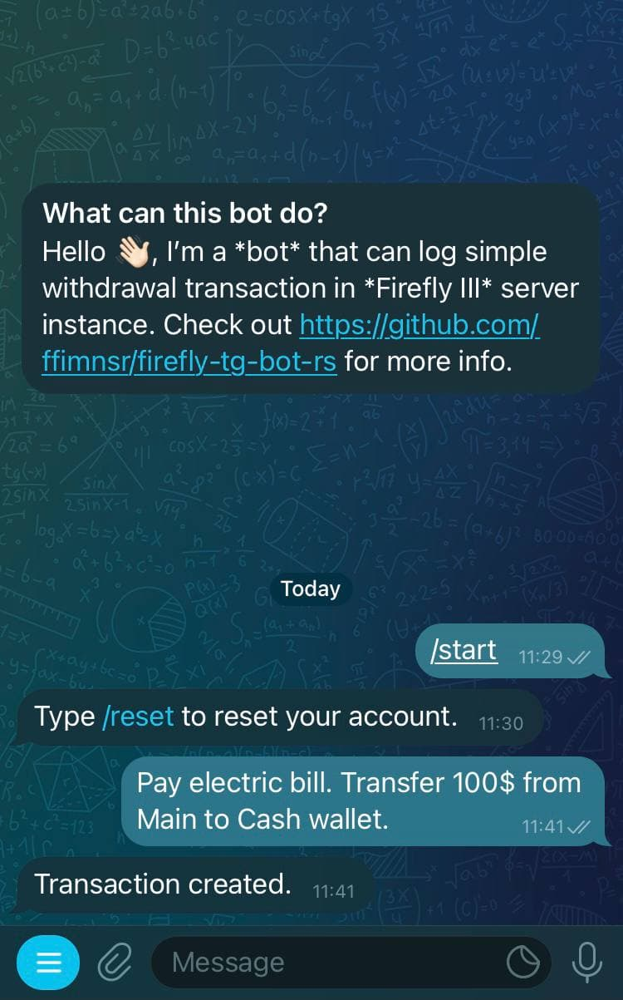

# Firefly Telegram Bot

> Fireflies are free, so beautiful. (Les lucioles sont libres, donc belles.) \
> ― Charles de Leusse, Les Contes de la nuit

This is a simple Telegram bot with interface to Firefly III to process and store simple transactions (e.g. withdraw, deposit, transfer).



This bot uses natural language processing ([NLP](https://en.wikipedia.org/wiki/Natural_language_processing)).

The public bot can be accessed in telegram `@FinanceFlyBot`. I advised to create your own bot as the DB for this is not encrypted and for testing purposes only. The bot is hosted in Azure App Services free tier.

## Docker 🐋

Docker images can be found in this link:

- Github \
    https://github.com/ffimnsr/firefly-tg-bot-rs/pkgs/container/firefly-tg-bot-rs

    ```
    docker pull ghcr.io/ffimnsr/firefly-tg-bot-rs:latest
    ```

- Dockerhub \
    https://hub.docker.com/repository/docker/0x61c88647/firefly-tg-bot-rs

    ```
    docker pull 0x61c88647/firefly-tg-bot-rs:latest
    ```

## Deployment

The bot can be easily deployed through containerization (e.g. docker). \
To run the docker image:

```
docker run \
    -e TG_BOT_TOKEN=<tg-token> \
    -e TG_MASTER_ID=<chat-id or user-id> \
    -e FF_BASE_PATH=<firefly-url> \
    -e FF_PAT=<firefly-token> \
    -e APP_SHARED_STORAGE_PATH=/var/lib/ff-bot-db \
    -e WIT_ACCESS_TOKEN=<wit-access-token> \
    -v $PWD:/var/lib/ff-bot-db \
     0x61c88647/firefly-tg-bot-rs:latest
```

### The `wit.ai` Bot

The bot can be found [here](https://wit.ai/apps/1038621580282771). Use your facebook login to access the bot, its open and can be accessed freely. All private data will not be stored in the utterance list. You can export it to create your own bot.

### Environment Variables

This are the relevant environment variables **needed** to be set.

**TG_BOT_TOKEN** - The telegram bot token which can be found in **BotFather** after creating a new bot. \
**TG_MASTER_ID** - The responsible person on where to report error (can be a group, channel, or user). \
**FF_BASE_PATH** - The firefly III instance that this bot will connect to. \
**FF_PAT** - This is your firefly III personal access token. \
**APP_SHARED_STORAGE_PATH** - The path where the local account storage will be stored (e.g. `/var/lib/ff-bot-db`). \
**WIT_ACCESS_TOKEN** - This is your **wit.ai** access token.

### What's in the roadmap?

- [ ] Create state machine to reduce code duplication.
- [ ] Make bot accept more words.


## License

Licensed under either of

- Apache License, Version 2.0 ([LICENSE-APACHE](LICENSE-APACHE) or
  http://www.apache.org/licenses/LICENSE-2.0)
- MIT license ([LICENSE-MIT](LICENSE-MIT) or http://opensource.org/licenses/MIT)

at your option.

### Contribution

Unless you explicitly state otherwise, any contribution intentionally submitted for inclusion in the work by you, as defined in the Apache-2.0 license, shall be dual licensed as above, without any additional terms or conditions.

## Related Projects

- [vjFaLk/firefly-bot](https://github.com/vjFaLk/firefly-bot) - inspiration bot project which also use Telegram and Firefly III.

## Refernces

- [Telegram Bot API](https://core.telegram.org/bots/api)
